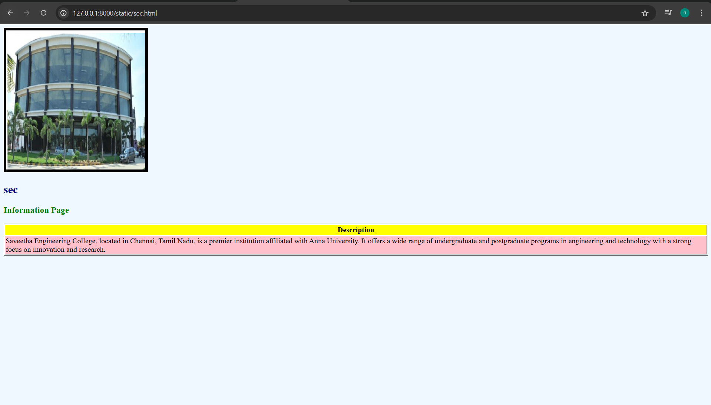
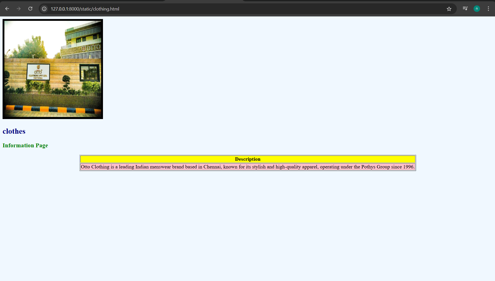
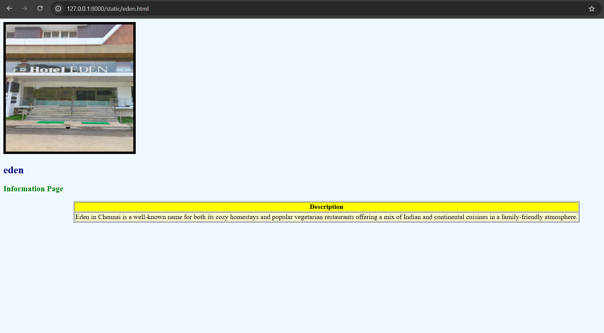
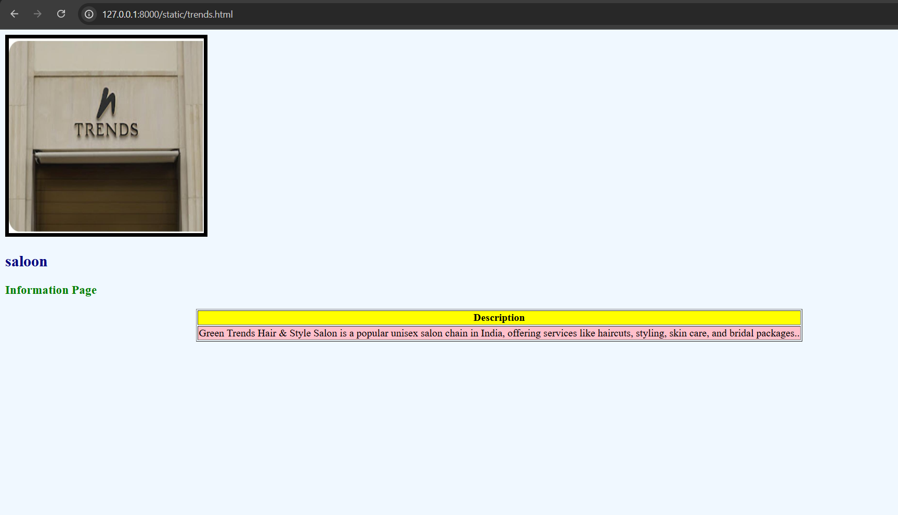
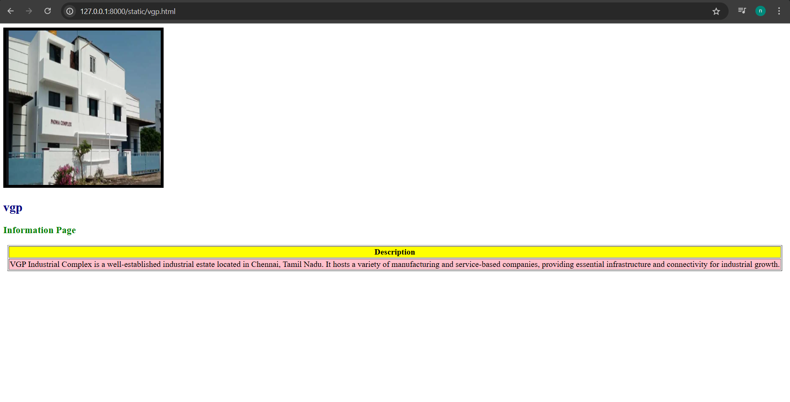

# Ex04 Places Around Me
## Date: 

## AIM
To develop a website to display details about the places around my house.

## DESIGN STEPS

### STEP 1
Create a Django admin interface.

### STEP 2
Download your city map from Google.

### STEP 3
Using ```<map>``` tag name the map.

### STEP 4
Create clickable regions in the image using ```<area>``` tag.

### STEP 5
Write HTML programs for all the regions identified.

### STEP 6
Execute the programs and publish them.

## CODE
```
<!-- Image Map Generated by http://www.image-map.net/ -->


<map name="image-map">
    <area target="" alt="sec" title="sec" href="sec.html" coords="1114,605,1431,558" shape="rect">
    <area target="" alt="clothes" title="clothes" href="clothing.html" coords="1506,556,1574,630,1485,618" shape="poly">
    <area target="" alt="saloon" title="saloon" href="trends.html" coords="1249,776,77" shape="circle">
    <area target="" alt="eden" title="eden" href="eden.html" coords="1422,1022,1247,962" shape="rect">
    <area target="" alt="vgp" title="vgp" href="vgp.html" coords="1481,1032,1547,1106,1363,1105" shape="poly">
</map>

map1.

<!DOCTYPE html>
<html>
<head>
  <title>sec- Info Page</title>
</head>
<body bgcolor="AliceBlue"> 

  
  <h2 style="color: navy;">sec</h2>
  <h3 style="color: green;">Information Page</h3>

  <table border="1" align="center">
    <tr bgcolor="Yellow">
      <th>Description</th>
    </tr>
    <tr bgcolor="pink">
      <td>Saveetha Engineering College, located in Chennai, Tamil Nadu, is a premier institution affiliated with Anna University. It offers a wide range of undergraduate and postgraduate programs in engineering and technology with a strong focus on innovation and research.</td>
    </tr>
  </table>

</body>
</html>

map 2

<!DOCTYPE html>
<html>
<head>
  <title>Clothes- Info Page</title>
</head>
<body bgcolor="AliceBlue"> 

  
  <h2 style="color: navy;">clothes</h2>
  <h3 style="color: green;">Information Page</h3>

  <table border="1" align="center">
    <tr bgcolor="Yellow">
      <th>Description</th>
    </tr>
    <tr bgcolor="pink">
      <td>
Otto Clothing is a leading Indian menswear brand based in Chennai, known for its stylish and high-quality apparel, operating under the Pothys Group since 1996.</td>
    </tr>
  </table>

</body>
</html>

map 3

<!DOCTYPE html>
<html>
<head>
  <title> eden - Info Page</title>
</head>
<body bgcolor="AliceBlue"> 

  
  <h2 style="color: navy;">eden</h2>
  <h3 style="color: green;">Information Page</h3>

  <table border="1" align="center">
    <tr bgcolor="Yellow">
      <th>Description</th>
    </tr>
    <tr bgcolor="LemonChiffon">
      <td>Eden in Chennai is a well-known name for both its cozy homestays and popular vegetarian restaurants offering a mix of Indian and continental cuisines in a family-friendly atmosphere.</td>
    </tr>
  </table>

</body>
</html>

map 4

<!DOCTYPE html>
<html>
<head>
  <title>saloon - Info Page</title>
</head>
<body bgcolor="AliceBlue"> 

  
  <h2 style="color: navy;">saloon</h2>
  <h3 style="color: green;">Information Page</h3>

  <table border="1" align="center">
    <tr bgcolor="Yellow">
      <th>Description</th>
    </tr>
    <tr bgcolor="pink">
      <td>Green Trends Hair & Style Salon is a popular unisex salon chain in India, offering services like haircuts, styling, skin care, and bridal packages..</td>
    </tr>
  </table>

</body>
</html>

map 5

<!DOCTYPE html>
<html>
<head>
  <title>vgp- Info Page</title>
</head>
<body bgcolor="white"> 

  
  <h2 style="color: navy;">vgp</h2>
  <h3 style="color: green;">Information Page</h3>

  <table border="1" align="center">
    <tr bgcolor="Yellow">
      <th>Description</th>
    </tr>
    <tr bgcolor="pink">
      <td>
VGP Industrial Complex is a well-established industrial estate located in Chennai, Tamil Nadu. It hosts a variety of manufacturing and service-based companies, providing essential infrastructure and connectivity for industrial growth.</td>
    </tr>
  </table>

</body>
</html>
```


## OUTPUT









## RESULT
The program for implementing image maps using HTML is executed successfully.
